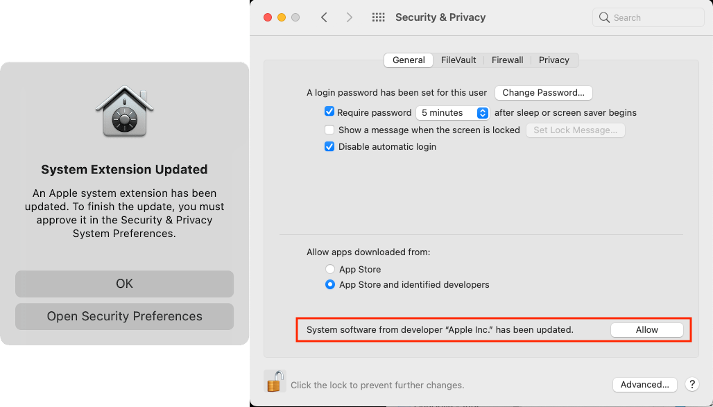

I was recently surprised by a pop-up dialogue in macOS asking me to
approve a system extension (kext, or kernel extension) in the
Security & Privacy preferences panel. I could not recall what, if any,
software I had recently updated and was immediately suspicious.



It was difficult to pin down any information since the kext was not
specified in the pop-up or the preferences panel. I [found one post on Apple Discussions](https://discussions.apple.com/thread/252404518)
that introduced me to the `kmutil` program:

```
$ kmutil log show
...
2022-02-04 14:35:49.437506-0500 0x3d0908   Default     0x0                  102    0    kernelmanagerd: [com.apple.kernelmanagerd.logging:LoadRequestResolution] gathering approvals for: 
	/Library/Apple/System/Library/Extensions/RemoteVirtualInterface.kext
2022-02-04 14:35:49.501178-0500 0x3d0908   Error       0x0                  102    0    kernelmanagerd: library rebuild request failed: Extension with identifiers com.apple.nke.rvi not approved to load. Please approve using System Preferences.
...
```

From the logs we can see a particular identifier with related kext file requires approval:
* `com.apple.nke.rvi`
* `.../Extensions/RemoteVirtualInterface.kext`

"Remote Virtual Interface" seems to be a tool used for [Recording a Packet Trace](https://developer.apple.com/documentation/network/recording_a_packet_trace) - I believe typically used while developing iOS apps.

I [tracked down a second tool](https://apple.stackexchange.com/a/155168/178626), `codesign`, that can
authenticate the kext. If `codesign` returns `0` status (i.e. success) the kext is valid:

```
❯ codesign -d --verbose=4 /Library/Apple/System/Library/Extensions/RemoteVirtualInterface.kext
Executable=/Library/Apple/System/Library/Extensions/RemoteVirtualInterface.kext/Contents/MacOS/RemoteVirtualInterface
Identifier=com.apple.nke.rvi
Format=bundle with Mach-O universal (x86_64 arm64e arm64)
CodeDirectory v=20100 size=290 flags=0x0(none) hashes=4+3 location=embedded
Hash type=sha256 size=32
CandidateCDHash sha1=2945602eada16a5ef1a1ec22968c9172cda7500c
CandidateCDHashFull sha1=2945602eada16a5ef1a1ec22968c9172cda7500c
CandidateCDHash sha256=ba857c40bcfaf664a5f8a0015d58e3eca8929168
CandidateCDHashFull sha256=ba857c40bcfaf664a5f8a0015d58e3eca892916899812a8da80bccb64ae5ba3f
Hash choices=sha1,sha256
CMSDigest=cce1f226974ca1222e52271b14115be1dace14b375ab32405918c617b5f9b47e
CMSDigestType=2
Page size=4096
CDHash=ba857c40bcfaf664a5f8a0015d58e3eca8929168
Signature size=4523
Authority=Software Signing
Authority=Apple Code Signing Certification Authority
Authority=Apple Root CA
Signed Time=Oct 30, 2021 at 9:59:49 PM
Info.plist entries=23
TeamIdentifier=not set
Sealed Resources version=2 rules=13 files=1
Internal requirements count=1 size=68

❯ echo $?
0
```

From the `codesign` manual:
> codesign exits 0 if all operations succeed. This indicates that all codes were signed, or all codes verified properly as requested. If a signing or verification operation fails, the exit code is 1. Exit code 2 indicates invalid arguments or parameters. Exit code 3 indicates that during verification, all path(s) were properly signed but at least one of them failed to satisfy the requirement specified with the -R option.

If you're ever surprised by a dialogue asking for approval of a system extension,
I hope these tools can help you track down and authenticate the software in question.

Of course, after all the work to track this down, while writing this post my Macbook Air
crashed and after reboot my explicit approval no longer seemed to be required!
